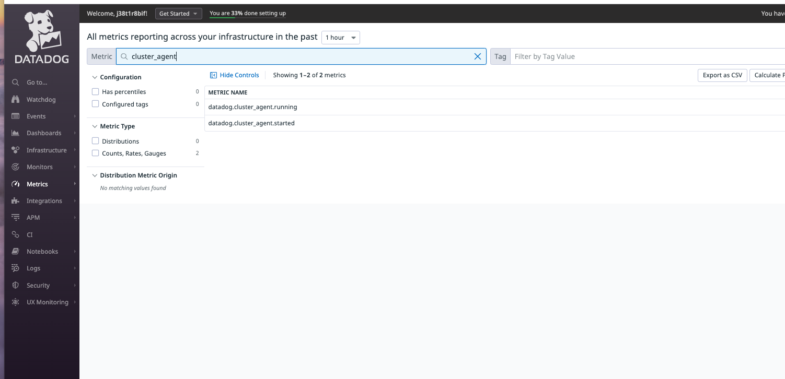

### 1. The Cluster Agent moves much of the job of interrogating the cluster out of the hands of each of the nodes into one or more instances. Since you are using a cluster made of one control plane node and one worker node, you won't experience much of a performance gain, but in your production systems, you may see a significant improvement.

### 2. Install dd cluster agent

```
helm install datadogagent --set datadog.apiKey=$DD_API_KEY --set datadog.appKey=$DD_APP_KEY -f values.yaml datadog/datadog
```

### 3. Look at the pods that are now running. 
```
kubectl get pods
```

### 4. Try running the different status commands for the Agent. To run the Agent's status command:
```
kubectl exec -ti $(kubectl get pods -l app=datadogagent-cluster-agent -o jsonpath='{.items[0].metadata.name}') -- agent status
```
### 5. To see the metadata that the cluster Agent is working with, run the Agent's metamap command:
```
k exec -ti $(k get pods -l app=datadogagent-cluster-agent -o jsonpath='{.items[0].metadata.name}') -- agent metamap
```
### 6. Navigate to the Metrics Summary page and search for cluster_agent. Notice that you now have access to a number of new metrics.


### 7. There are a number of other features you get with the Cluster Agent that help with applications running on top of your Kubernetes cluster.

* Horizontal Pod Autoscaler - You can autoscale your pods based on any metric collected. For instance, if the number of requests to your nginx pod increases, add a few pods to handle the load.

* Cluster Checks - Checks that can be autodiscovered and performed by the cluster agent against Kubernetes control plane services as well as out-of-cluster datastores and endpoints.

* Endpoint Checks - Checks that can be autodiscovered and perfomed to monitor any endpoint behind cluster services.