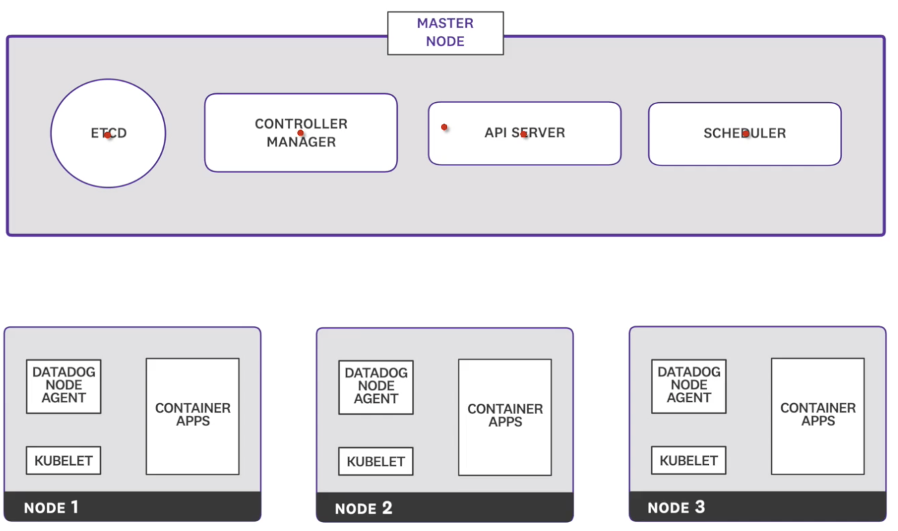
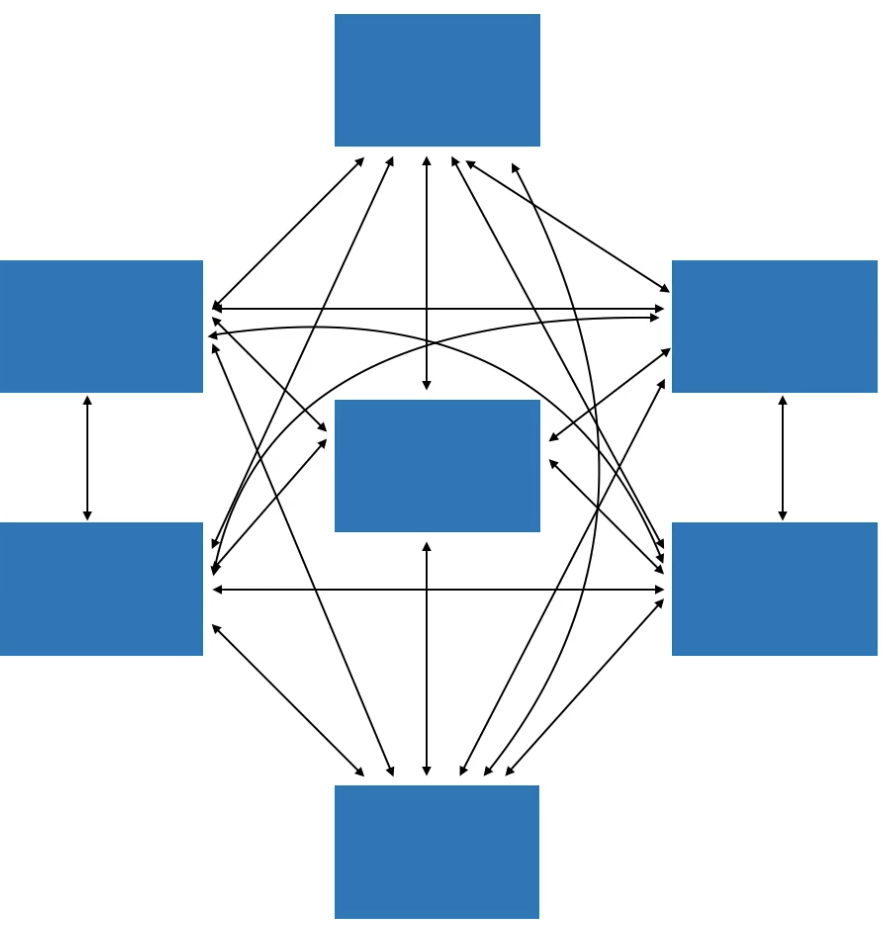
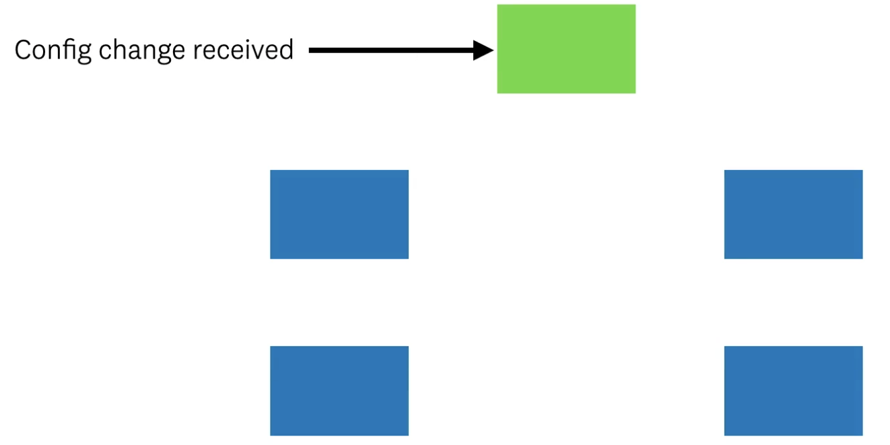
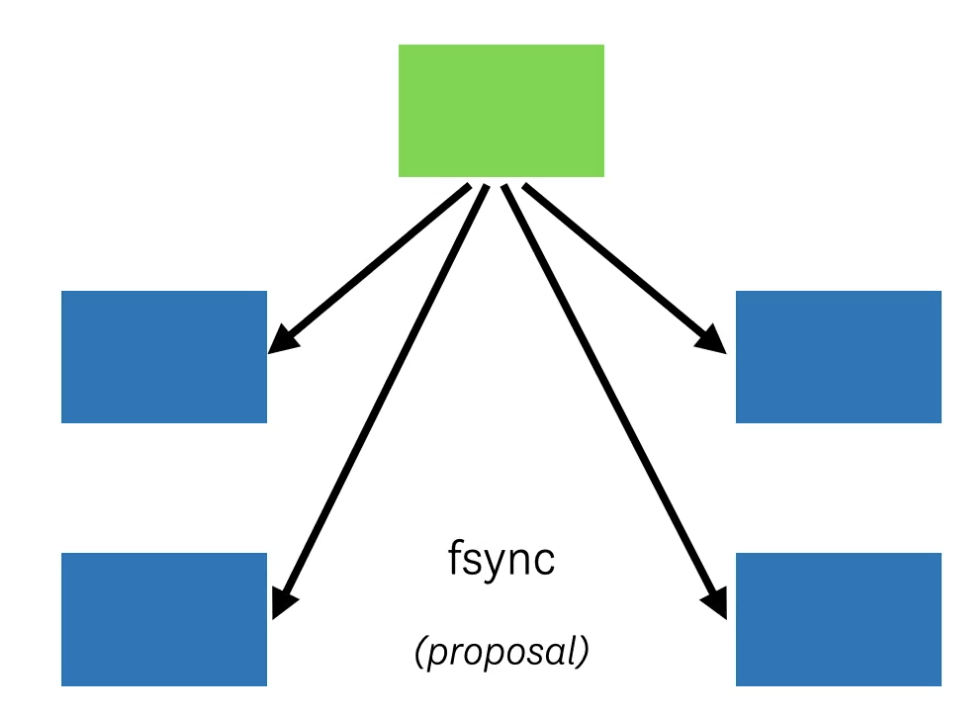
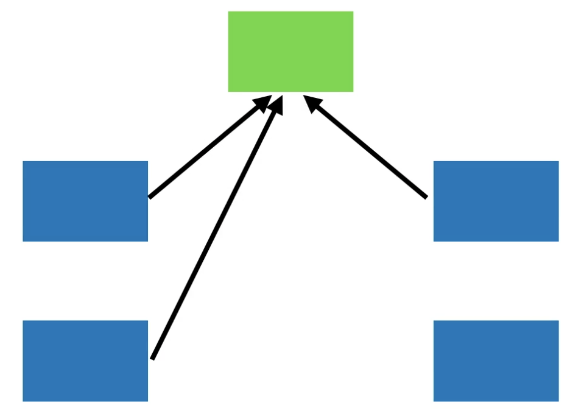
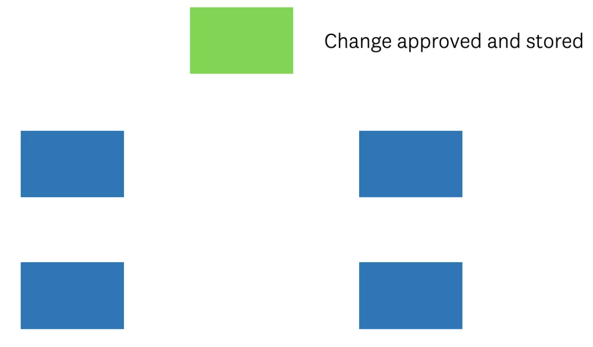
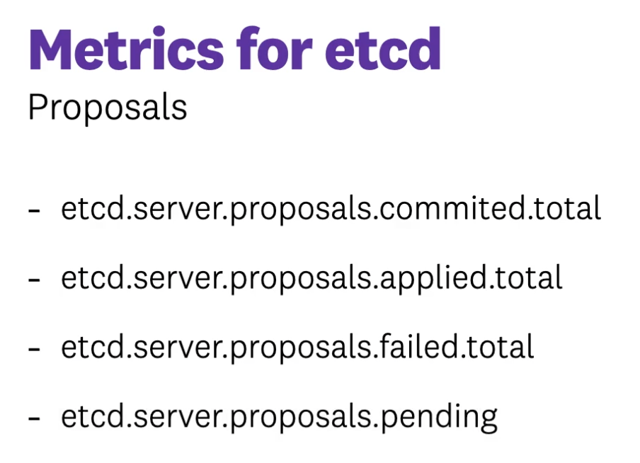
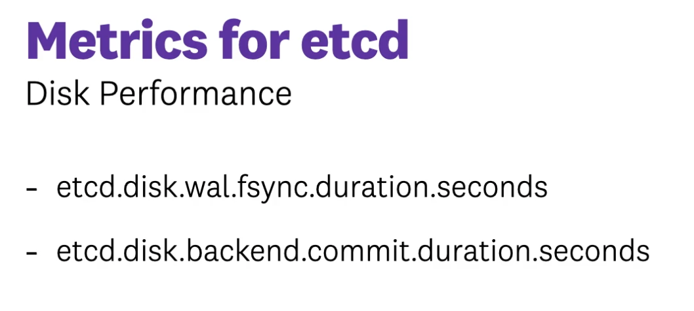
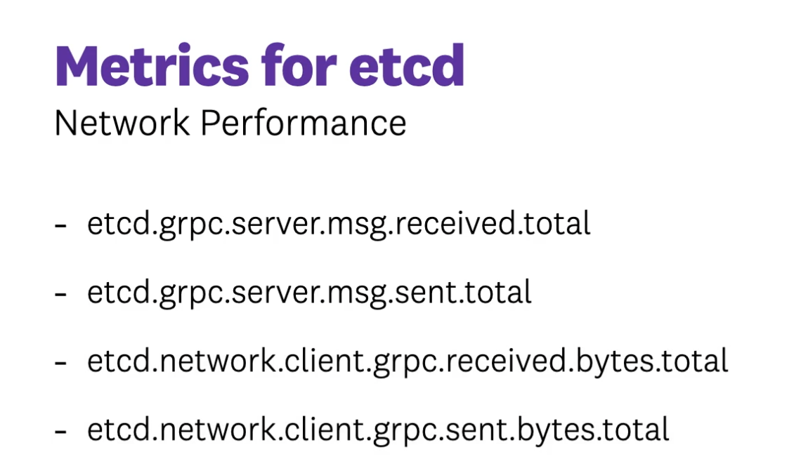
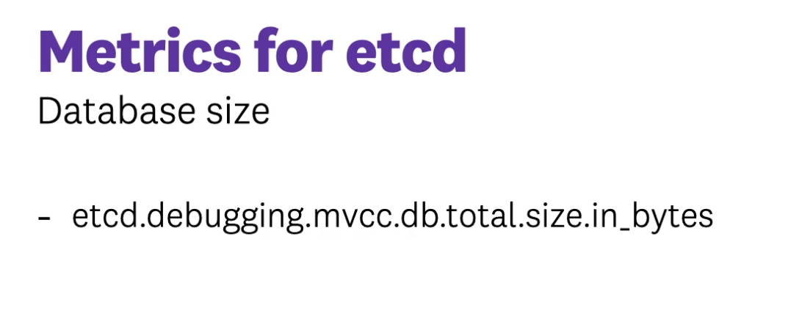

### etcd is the primary datastore for your Kubernetes cluster. You need to make sure your etcd environment is always healthy, otherwise nothing will work. You will see how to start monitoring etcd as well as what to look for. 

### References:

* https://thesecretlivesofdata.com/