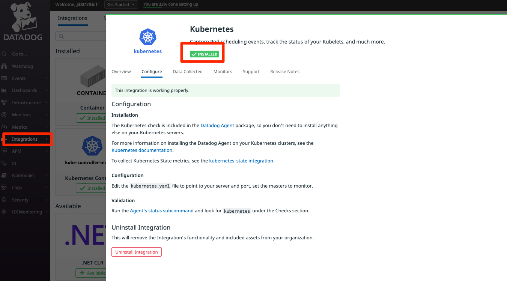
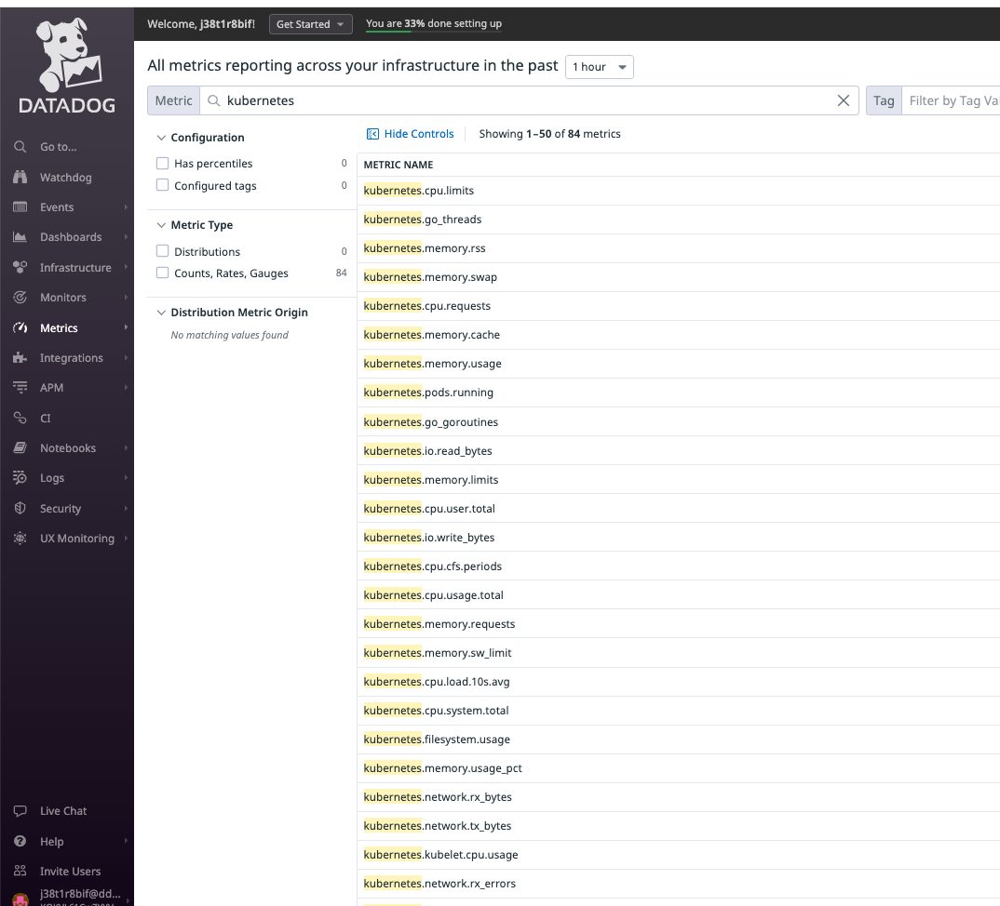
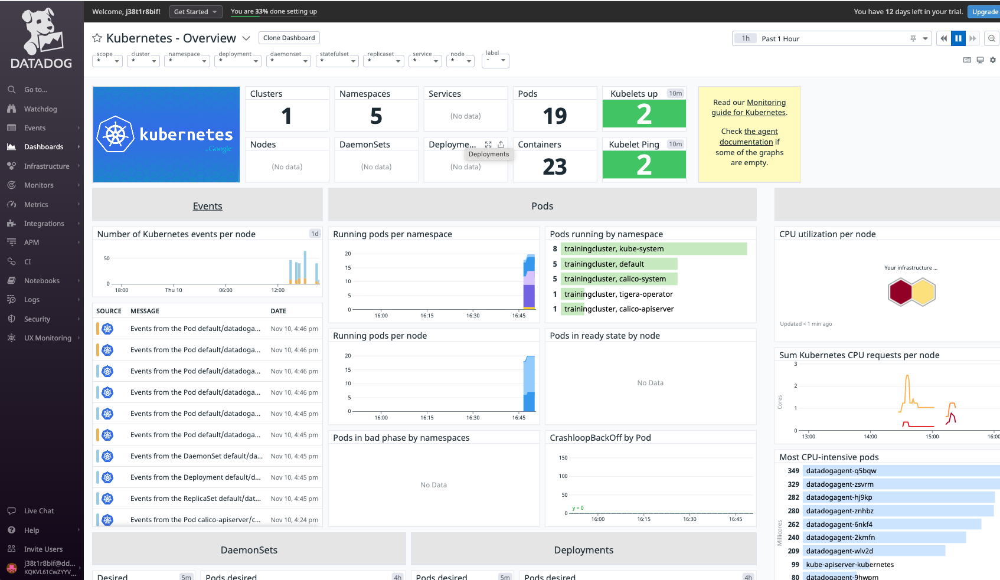

### 1. Install helm chart with the following command:
```
helm install datadogagent --set datadog.apiKey=$DD_API_KEY --set datadog.appKey=$DD_APP_KEY -f dd-agent-values.yaml datadog/datadog
```

### 2. Look in the event stream for the Agents to show up.

### 3. Next navigate to the Integrations page and open the Kubernetes integration. Click on the Configuration tab, and then click the Install button.



### 4. You can also run the Agent status command to make sure the checks are running OK now:
```
kubectl exec -ti $(kubectl get pods -l app=datadogagent -o jsonpath='{.items[0].metadata.name}') -- agent status
```

 ### 5. Metrics Summary page and you should see the kubernetes metrics start to appear. 
 
 
 ### 6. Take a look at the Kubernetes - Overview dashboard. Note that it can take a while for metrics to populate at first.
 


### 7. Now verify the health checks. You need the IP address of the Agent pod. You could use something like this:
```
kubectl get pods -o wide
```

### 8. Or if you enjoy using jq and want just the pod name and ip address, try this command:
```
kubectl get pod -o json | jq -r '.items[] | .metadata.name + " - IP: " + .status.podIPs[].ip '
```

### 9. Review values.yaml around line 201. You can see this is where the liveness probe is defined for the Agent. Now run this command in the terminal, replacing <pod ip address> with the address you found above.
```
curl <pod ip address>:5555/health
```

### 10. Pipe the output to `jq` to make the output a bit easier to read (`curl <pod ip address>:5555/health | jq`).

```
root@control-plane:~/lab# curl 192.168.192.68:5555/health | jq
  % Total    % Received % Xferd  Average Speed   Time    Time     Time  Current
                                 Dload  Upload   Total   Spent    Left  Speed
100   421  100   421    0     0   6101      0 --:--:-- --:--:-- --:--:--  6191
{
  "Healthy": [
    "healthcheck",
    "workloadmeta-store",
    "ad-kubeletlistener",
    "collector-queue-20s",
    "metadata-agent_checks",
    "metadata-inventories",
    "tagger-workloadmeta",
    "workloadmeta-docker",
    "ad-servicelistening",
    "dogstatsd-main",
    "metadata-host",
    "workloadmeta-puller",
    "collector-queue-900s",
    "ad-config-provider-kubernetes-container-allinone",
    "metadata-resources",
    "tagger-store",
    "aggregator",
    "collector-queue-15s"
  ],
  "Unhealthy": null
}
```

### 11. Notice that this is injecting the Agent pod into the command automatically.
